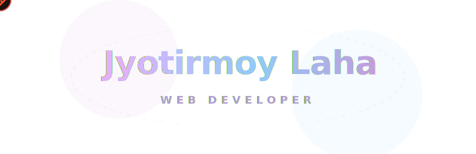

  

  
  

  

### 👨‍💻 About Me
* 🎓 **BCA Student (2nd Year)** with a strong foundation in Python, Data Structures & Algorithms, and Web Development.
* 🚀 **Builder Mindset** — Passionate about building real-world projects, not just college assignments.
* 🧠 **Philosophy** — I believe in learning by building, breaking things, and rebuilding them better.
* ⚡ **Fun Fact** — I don’t just learn tech — I build with it, break it, and rebuild it better.
* 💬 **Pronouns** — He / Him

  

### 🚀 Featured Projects

<table width="100%">
  <tr>
    <td width="50%" valign="top">
      <h4>🌌 StudyVerse</h4>
      
A beautifully crafted study journal & life tracker with a premium Japanese-inspired design.

      <a href="https://studyverse-vlzh.onrender.com/" target="_blank"><b>Live Demo 🌐</b></a>
    </td>
    <td width="50%" valign="top">
      <h4>🧠 AI Resume Analyzer & Skill Gap Finder</h4>
      
Python-based tool to analyze resumes and suggest personalized skill improvements.

      <a href="https://ai-resume-analyzer-hhhb.onrender.com" target="_blank"><b>Live Demo 🌐</b></a>
    </td>
  </tr>
  <tr>
    <td width="50%" valign="top">
      <h4>📋 Mess Manager</h4>
      
Real-time mess expense and fund tracker for hostel groups to manage shared budgets.

      <a href="https://mess-maneger.onrender.com/" target="_blank"><b>Live Demo 🌐</b></a>
    </td>
    <td width="50%" valign="top">
      <h4>☀️ Weather Web App</h4>
      
Real-time weather forecasting application built with a sleek, clean, and intuitive user interface.

      <a href="https://j-weather.onrender.com" target="_blank"><b>Live Demo 🌐</b></a>
    </td>
  </tr>
  <tr>
    <td colspan="2" valign="top">
      <h4>✨ Portfolio Website</h4>
      
My personal digital portfolio showcasing my latest tech projects, skills, and coding journey.

      <a href="https://jyotirmoy-portfolio.onrender.com" target="_blank"><b>Live Demo 🌐</b></a>
    </td>
  </tr>
</table>

  

## 💻 Tech Stack

<table width="100%">
  <tr>
    <td align="center" width="25%"><b>Languages</b></td>
    <td align="center" width="25%"><b>Frameworks & Libs</b></td>
    <td align="center" width="25%"><b>Databases & Backend</b></td>
    <td align="center" width="25%"><b>Tools & Platforms</b></td>
  </tr>
  <tr>
    <td valign="top" align="center">
        
        
        
        
      
    </td>
    <td valign="top" align="center">
        
      
    </td>
    <td valign="top" align="center">
        
        
      
    </td>
    <td valign="top" align="center">
        
        
        
        
        
      
    </td>
  </tr>
</table>

  

## 📊 GitHub Stats

  
  

  

  

### ✍️ Random Dev Quote

  

  

  

  

  

